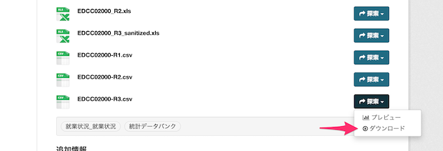

# Chapter 2 オープンデータの入手と整形: PythonとPolarsを用いた効果的な手法


**Polars** はデータ操作ライブラリです。\
同様のライブラリとして Pandas がありますが、Polars は Pandas と比較して高速とされています。

この教材では、オープンデータの探索、入手、そして整形をPythonとPolarsを使用して行う方法を学びます。\
具体的には、データの探索とダウンロード、CSVファイルの読み込み、そしてPolarsを使用したデータの整形というステップを通じて、PythonとPolarsの基本的な使い方を理解します。

## 1. オープンデータ探索

山梨県の公式ウェブサイトやオープンデータ提供サイトを利用して、分析に使用するデータを探します。

### 1.1 オープンデータとは

総務省サイトより引用\
https://www.soumu.go.jp/menu_seisaku/ictseisaku/ictriyou/opendata/

> 国、地方公共団体及び事業者が保有する官民データのうち、国民誰もがインターネット等を通じて容易に利用（加工、編集、再配布等）できるよう、次のいずれの項目にも該当する形で公開されたデータをオープンデータと定義する。
* 営利目的、非営利目的を問わず二次利用可能なルールが適用されたもの
* 機械判読に適したもの
* 無償で利用できるもの

### 1.2 山梨県のオープンデータ

山梨県の公式ウェブサイトで公開しているオープンデータは、主に3つの提供元があります。\
[山梨県オープンデータ利用規約](https://www.pref.yamanashi.jp/opendata/kiyaku.html) に従い、利用しましょう。

---

#### 1.2.1 やまなしの統計

https://www.pref.yamanashi.jp/opendata/statistics/toukei.html

統計調査課が所管する「やまなしの統計」に掲載されているデータを、オープンデータとして公開中です。


---

#### 1.2.2 山梨県オープンデータ検索

https://www.pref.yamanashi.jp/opendata/catalog/

情報政策課が所管するページから、山梨県ホームページに掲載されているオープンデータ（「やまなしデータプラットフォーム」掲載のデータを除く）の検索・ダウンロードができます。

2024年3月1日現在、10,743件のデータが登録されています。


---

#### 1.2.3 やまなしデータプラットフォーム

https://dataplatform-yamanashi.jp/

DX推進グループが所管する「やまなしデータプラットフォーム」掲載のデータを、オープンデータとして公開中です。\
オープンデータを可視化しているダッシュボード機能や、オープンデータをアプリケーションに組み込みできるようAPIを提供しています。

2024年3月1日現在、289件のデータセットが登録されています。


## 2. データダウンロード

適切なデータを見つけたら、CSV形式でダウンロードします。

ここでは、試しに1.2項のサイトに掲載されているオープンデータの中から好きなCSVファイルをダウンロードしましょう。\
（キャプチャは「産業別新規求人状況（令和3年）」の例）



ダウンロードしたCSVファイルは、Colaboratory 画面内の「ファイル」にドラッグアンドドロップしてアップロードします。


## 3. CSVの読み込み

Pythonの標準ライブラリを使用してダウンロードしたデータを読み込みます。

まずは polar ライブラリをインストールします。

```bash
pip install polar
```

次にアップロードしたCSVファイルを読み込みます。

必要に応じて、'data.csv'を自分が使用しているデータに合わせて書き換えてください。

```python
import polars as pl

# データの読み込み
df = pl.read_csv('data.csv')
```

```python
# 確認のため、読み込み結果の先頭10行を表示する
df.head(10)
```

```python
# 列名一覧を表示する
df.columns
```

```python
# glimpse() でデータの中身を確認することもできる
df.glimpse()
```

## 4. データ整形

Polarsを使用して、読み込んだデータを分析しやすい形に整形します。

必要に応じて、自分が使用しているデータに合わせて書き換えてください。

```python
# 指定した列名で並べ替え
df = df.sort("年")
```

```python
# 列名の変更
df = df.rename({"年":"year", "月":"month", "産業名_大分類":"category", 
                "産業名_中分類":"subcategory", "人数_人": "number"})
```

```python
# 各月の「情報通信業」の行のみを抽出する
df = df.filter(df["category"] == "情報通信業")
```

```python
# 確認のため、読み込み結果の先頭10行を表示する
df.head(10)
```

## 5. データ保存

整形したデータを再度CSV形式で保存します。これにより、後のステップで再度読み込むことなくデータを使用することができます。

```python
# 整形したデータの保存
df.write_csv('formatted_data.csv')
```

'formatted_data.csv'が生成されていることを確認します。このファイルがあれば、データの整形は成功です。

この手順を繰り返し、PythonとPolarsを使用したデータの整形に慣れてください。

